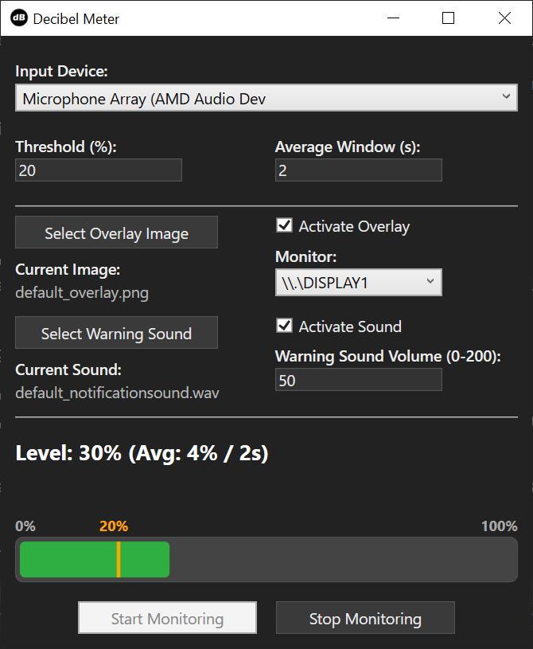

# Decibel Meter

**Decibel Meter** is a Windows desktop application for monitoring audio input levels in real time. It provides a visual and audio warning system when sound exceeds a user-defined threshold, and can display a transparent overlay image on any monitor as an additional alert.

Originally created due to my headphones isolating too well and thus my speaking volume increasing without me noticing.

(I'm aware it's somewhat spaghetti code but this my first time creating a desktop application)

---

## Features

- **Real-Time Audio Level Monitoring (Percent-based):**  
  Continuously measures audio input from any available recording device and displays the level as a normalized percentage (0�100%).

- **Customizable Threshold (Percent):**  
  Set the percentage level at which warnings are triggered. The threshold is based on a normalized percent scale, making it more intuitive and consistent across devices.

- **Configurable Averaging Window (0�5s, fractional):**  
  Rolling average window can be adjusted live (e.g. 0, 0.5, 1.25, 3.8). A value of **0** switches to instant (no averaging) mode.

- **Averaged Trigger Logic:**  
  Warning activates only when the rolling average exceeds the threshold, reducing false alarms from short spikes.

- **Sensitivity Adjustment:**  
  Internal sensitivity scaling ensures typical microphones can reach 100% with loud input. (No calibration required.)

- **Visual Feedback:**  
  - Live percentage level bar with a threshold indicator.  
  - Output text color changes when the average level exceeds the threshold.  
  - **Bar Visual Aids:** 0% and 100% labels above the bar, and a dynamic threshold value label positioned above the threshold indicator.

- **Input Validation & Safe Start:**  
  Threshold (0�100), average window (0�5), and volume (0�200) are validated. Start is disabled until all inputs are valid.

- **Audio Warning:**  
  - Play a custom warning sound when the threshold is crossed.  
  - Adjustable warning sound volume (0�200%).  
  - Volume label + input automatically hide when the sound feature is disabled for cleaner UI.  

- **Overlay Alert:**  
  - Displays a transparent, borderless overlay image on the selected monitor when the threshold is exceeded.  
  - Overlay image fades out smoothly when the level drops below the threshold.  
  - You can select a custom overlay image; last selection is remembered.  
  - Monitor selector hides when overlay feature is disabled.

- **Always-Accessible File Selection:**  
  Sound and overlay file selection buttons stay enabled regardless of feature toggles.

- **Multi-Monitor Support:**  
  Choose which monitor displays the overlay.

- **Persistent Settings:**  
  Remembers last used device, threshold, monitor, overlay image, warning sound, volume, averaging window, and feature toggles.

---

## Getting Started

### Prerequisites

- Windows 10 or later
- [.NET 8 SDK](https://dotnet.microsoft.com/download/dotnet/8.0)
- Visual Studio 2022 (recommended)

### Installation

1. **Clone the repository:**

2. **Open the solution in Visual Studio 2022.**

3. **Restore NuGet packages** (NAudio is required).

4. **Build and run the project.**

### Usage

1. **Select Input Device:**  
   Choose your preferred audio input (microphone) from the dropdown.

2. **Set Threshold:**  
   Enter the percentage value at which you want to trigger warnings.

3. **Adjust Average Window:**  
   Set averaging duration in seconds (0 = instant, up to 5, supports decimals).

4. **Select Warning Sound (optional):**  
   Click "Select Warning Sound" to choose a custom audio file (`.wav`, `.mp3`, `.ogg`).

5. **Adjust Warning Volume:**  
   Set the warning sound volume (0�200%).

6. **Select Overlay Image / Monitor:**  
   Pick an overlay image and monitor (monitor selector only visible when overlay is enabled).

7. **Start Monitoring:**  
   Click "Start" (only enabled when all inputs are valid).  
   - If the average (or instant) level exceeds the threshold:
     - The overlay appears and fades out when below threshold.
     - A warning sound plays (if enabled).
     - UI updates reflect state.

8. **Stop Monitoring:**  
   Click "Stop" to end monitoring and hide overlay + threshold indicator.

---

## Configuration

Settings are saved automatically and loaded on startup, including:
- Selected audio device
- Threshold value (percent)
- Average window (seconds)
- Selected monitor
- Warning sound path and volume
- Overlay image path
- Feature toggles (sound / overlay)

---

## Dependencies

- [NAudio](https://github.com/naudio/NAudio) � for audio input and playback

---

## Changelog

### Version 1.1

**Improvements:**
- **Switched from decibel to percent-based level monitoring** for more intuitive and device-independent readings.
- **Threshold is now set as a percentage** (0�100%) instead of dB.
- **Averaged trigger logic:** Warnings are only triggered if the average level over the last 2 seconds exceeds the threshold avoiding false positives.
- **Sensitivity adjustment:** Internal scaling ensures typical microphones can reach 100% with loud input.
- **Overlay fade-out:** Overlay image now fades out smoothly over 1 second instead of disappearing instantly.
- **Bar visual aids:** Added 0% and 100% labels above the bar, and a dynamic threshold value label positioned above the threshold indicator.
- **Threshold indicator is hidden until monitoring starts** to avoid visual clutter.
- **Numerous UI/UX overhaul/improvements** for clarity and usability.

**Fixed bugs:**
  - Fixed issue where overlay would not reappear if the threshold was crossed again after fading out.

### Version 1.1.1

**Improvements:**
- File selection buttons (warning sound / overlay image) remain enabled even when their features are disabled.
- Warning sound volume label + textbox now hide (collapse) instead of being disabled when sound is off.
- Horizontal alignment adjusted so sound and overlay activation checkboxes line up consistently.
- Overlay image selection clarified (user can provide custom image; persisted).
- More robust initialization order prevents early checkbox event firing from causing errors.

**Fixes:**
- Resolved a `NullReferenceException` caused by checkbox events firing before controls/config were ready during window initialization.
- Minor layout polish in sound and overlay sections.

### Version 1.1.2

**Improvements:**
- Added configurable **average window (0�5s, fractional)** with live application (no restart / restart of monitoring required).
- Support for **instant mode** (average window = 0) showing raw readings.
- Input validation added for threshold (0�100), average window (0�5), and volume (0�200) with red border + tooltips.
- Start button now disabled until all inputs are valid (prevents invalid monitoring sessions).
- Prevented multiple concurrent monitoring starts (double-click / repeated start guard).
- Monitor selector and warning volume fields repositioned beneath their respective feature toggles for clearer grouping.
- Monitor selector hides when overlay is disabled (consistent with volume hide behavior).
- Cleanup of unused internal fields and minor refactors for clarity.

**Fixes:**
- Warning sound volume not persisting across restarts (event wiring + final commit on focus loss / close).
- Occasional missed save of average window or threshold during rapid edits (centralized validation + guarded initialization).
- Removed obsolete internal state flag (overlay visibility tracker) that was no longer used.
- Ensured proper disposal path when audio start fails.

---

**Decibel Meter** is designed for anyone needing a simple, customizable audio level monitor with visual and audio alerts.